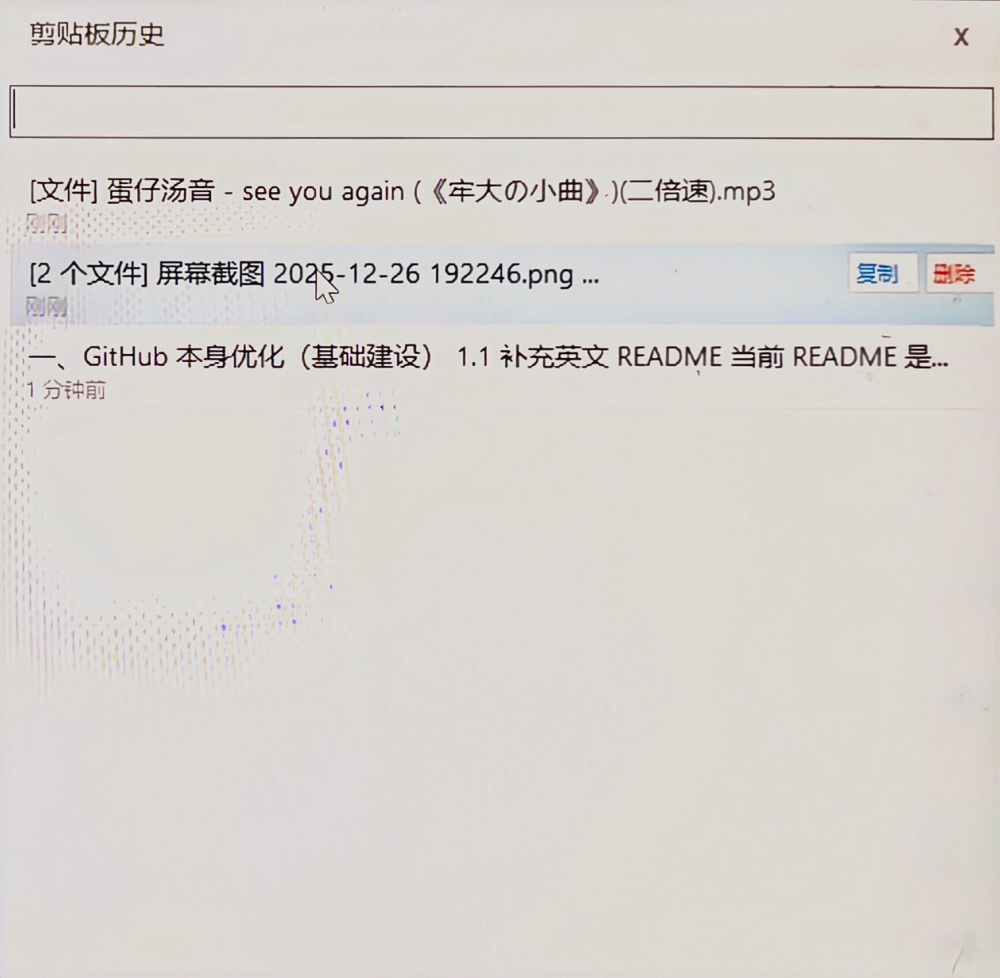

# ClipLite - 极致轻量剪贴板管理器


> [English](README_EN.md) | [中文](README.md)
[](https://dotnet.microsoft.com/download/dotnet-framework/net48)
[](LICENSE)



---

## 简介

ClipLite 是一款 **极致轻量化 + 秒开体验 + 无广告绿色便携** 的 Windows 剪贴板管理器。

旨在替代 Windows 原生剪贴板（Win+V），解决单次复制覆盖文本内容的核心痛点。基于 C# + WinForms + .NET Framework 4.8 构建，依赖系统自带运行时，即下即用。

| 指标     | 目标值    | 实际值     |
| -------- | -------- | -------- |
| EXE 体积 | < 1 MB   | **25 KB** |
| 后台内存 | 6~12 MB  | 实测约 8~10 MB（GC 稳定后） |
| 启动时间 | < 200 ms | **< 50 ms** |
| 热键唤起 | < 50 ms  | **即时**（窗口预创建） |
| CPU 占用 | 0%       | **0%**（消息驱动，无轮询） |

---

## 功能说明

### 1. 自动剪贴板监听

- 监听系统级剪贴板变化事件（`WM_CLIPBOARDUPDATE`），**零 CPU 轮询**
- 文本内容被复制时自动保存到历史列表
- 最多保存 **500 条** 记录，超出时自动移除最旧条目

### 2. Hash 去重 + 防回写

- 每条文本通过 **SHA256 取前 16 位** 生成唯一指纹
- 相同内容不会被重复添加，仅移 **至列表顶部**（最近使用优先）
- 从 ClipLite 选中复制时自动跳过本次回写，产生死循环

### 3. 全局热键唤起

| 操作 | 快捷键 |
| ---- | ---- |
| 打开/隐藏历史面板 | `Ctrl + Shift + V` |
| 关闭面板 | `Esc` |
| 选中下一条 | `↓` 方向键（聚焦列表框后） |
| 选中上一条 | `↑` 方向键 |
| 删除当前条目 | `Delete` |
| 切换到搜索框 | `↓`（搜索框聚焦时落入列表） |

- 热键通过 Win32 `RegisterHotKey` 注册，全局生效
- 历史面板在启动时 **预先创建**，热键按下时立即显示

### 4. 一键复用

- **鼠标点击** 或 **回车键** 选中条目
- 自动复制该条目内容到剪贴板
- 面板自动隐藏，直接 `Ctrl + V` 粘贴
  - 无需额外操作，极速工作流

### 5. 全文搜索

- 面板顶部搜索框，**输入即搜**（实时过滤）
- 不区分大小写，匹配历史记录中的任意文本片段
- 搜索结果依然保留置顶排序

### 6. 置顶管理

- 代码支持按条目置顶（`IsPinned` 字段）
- 置顶条目显示 **橙色「置顶」标记**，并永久排在列表顶部
- 支持右键 Pin / Unpin（后续可扩展右键菜单）

### 7. 托盘后台驻留

- 启动后静默运行于系统托盘
- 托盘右键菜单：

| 菜单项 | 功能 |
| ------ | ---- |
| 显示历史 | 弹出历史面板 |
| 暂停监听 | 停止收集新的剪贴板内容 |
| 恢复监听 | 恢复收集 |
| 清空历史 | 确认后清除所有记录 |
| 退出 | 完全退出程序 |

- 托盘图标 **双击** 也弹出历史面板
- 图标为蓝色剪贴板，视觉辨识度高

### 8. 数据持久化

- 历史记录保存至 exe 同级目录下的 `cliplite_history.json`
- JSON 格式，纯文本可读，体积小，启动快
- 存储字段：`id`（Hash）、`text`（原文）、`time`（ISO 时间戳）、`pinned`（置顶标记）

---

## 项目结构

```
ClipLite/
├── .gitignore                      # Git 忽略规则
├── .gitattributes                  # Git 属性配置（行尾处理）
├── README.md                       # 本文件
│
├── Program.cs                      # 入口 + 应用编排
├── Models.cs                       # 数据模型 + JSON 存储
├── Services.cs                     # 剪贴板监听 + 热键管理
├── HistoryForm.cs                  # 历史面板 UI
│
├── build.bat                       # 一键编译脚本
├── ClipLite.exe                    # 编译产物（25 KB）
└── cliplite_history.json           # 运行后自动生成的用户数据
```

---

## 三层架构

```
┌─────────────────────────────────────────────────────────┐
│                    交互层 (Presentation)                │
│  ┌──────────────────────────────────────────────────┐  │
│  │  HistoryForm.cs                                  │  │
│  │  - 无边框弹出面板 (阴影 + 置顶)                   │  │
│  │  - 搜索框 (实时过滤)                              │  │
│  │  - 自绘条目列表 (预览 + 时间 + 置顶标记)           │  │
│  │  - 键盘/鼠标事件处理                              │  │
│  └──────────────────────────────────────────────────┘  │
├─────────────────────────────────────────────────────────┤
│                    业务逻辑层 (Business Logic)          │
│  ┌──────────────────────────────────────────────────┐  │
│  │  Services.cs - ClipboardMonitor                  │  │
│  │  - Windows 消息窗口 (NativeWindow)               │  │
│  │  - AddClipboardFormatListener 监听               │  │
│  │  - 消息分发 (ClipboardChanged + WindowMessage)    │  │
│  │  - SHA256 Hash 去重                               │  │
│  └──────────────────────────────────────────────────┘  │
│  ┌──────────────────────────────────────────────────┐  │
│  │  Services.cs - HotkeyManager                    │  │
│  │  - RegisterHotKey / UnregisterHotKey            │  │
│  │  - Ctrl+Shift+V 热键绑定                         │  │
│  │  - WM_HOTKEY 消息处理                            │  │
│  └──────────────────────────────────────────────────┘  │
│  ┌──────────────────────────────────────────────────┐  │
│  │  Program.cs - ClipLiteContext                    │  │
│  │  - 应用生命周期管理                               │  │
│  │  - 事件编排 (监视器 → 热键 → 面板 → 存储)         │  │
│  │  - 托盘图标与右键菜单                             │  │
│  │  - 单例保护 (Mutex)                              │  │
│  └──────────────────────────────────────────────────┘  │
├─────────────────────────────────────────────────────────┤
│                    数据持久层 (Data Persistence)        │
│  ┌──────────────────────────────────────────────────┐  │
│  │  Models.cs - ClipboardEntry                     │  │
│  │  - 数据模型 (Id / Text / Timestamp / IsPinned)   │  │
│  │  - PreviewText / TimeDisplay 辅助属性            │  │
│  └──────────────────────────────────────────────────┘  │
│  ┌──────────────────────────────────────────────────┐  │
│  │  Models.cs - JsonStorage                        │  │
│  │  - 手动 JSON 序列化 (无外部依赖)                  │  │
│  │  - 最大容量 500 条自动修剪                       │  │
│  │  - 读: Deserialize (状态机解析)                  │  │
│  │  - 写: Serialize (StringBuilder)                │  │
│  └──────────────────────────────────────────────────┘  │
└─────────────────────────────────────────────────────────┘
```

---

## 技术栈

| 项目 | 选型 |
| ---- | ---- |
| 语言 | C# 5.0 |
| 框架 | .NET Framework 4.8 (Windows 自带) |
| UI | WinForms (System.Windows.Forms) |
| 图形 | System.Drawing |
| 编译器 | csc.exe (系统自带) |
| 存储 | JSON 文件 |
| 构建 | 单批处理命令 `build.bat` |

---

## 快速开始

### 方法一：直接运行

```
ClipLite\ClipLite.exe
```

启动后托盘出现蓝色图标，按 `Ctrl + Shift + V` 即可调出历史面板。

### 方法二：自行编译

```bat
cd ClipLite
build.bat
```

编译产物为 `ClipLite.exe`（25 KB）。

**环境要求：** Windows 10/11（自带 .NET Framework 4.8），无需任何额外安装。

---

## 常见问题

**Q：如何修改热键？**  
在 `Services.cs` 的 `HotkeyManager` 类中修改 `VK_V` 和 `MOD_CONTROL | MOD_SHIFT` 常量，重新编译即可。

**Q：最多能存多少条历史？**  
默认 500 条。在 `Models.cs` 中修改 `MaxEntries` 常量可调整上限。

**Q：JSON 历史文件在哪？**  
与 `ClipLite.exe` 同目录，文件名 `cliplite_history.json`。
删除该文件即可清空历史记录（下次启动自动重建）。

**Q：如何开机自启？**  
创建 `ClipLite.exe` 的快捷方式，放入 `shell:startup` 启动文件夹。

---

## License

MIT

